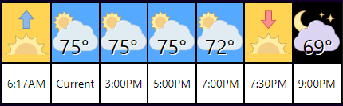

# hass_weatherwidget

You'll need an appid from api.openweathermap.org, until I figure out how to store the appid in HASS it's just hardcoded on line 91.

appid: '[myappid]',

example:

appid: '123456',

Just copy the files to HA's www folder (I use weather_widget) and use an iframe card. Aspect ratio of 30% seems to work well:

  - type: iframe
    url: /local/weather_widget/weather.html
    aspect_ratio: 30%
